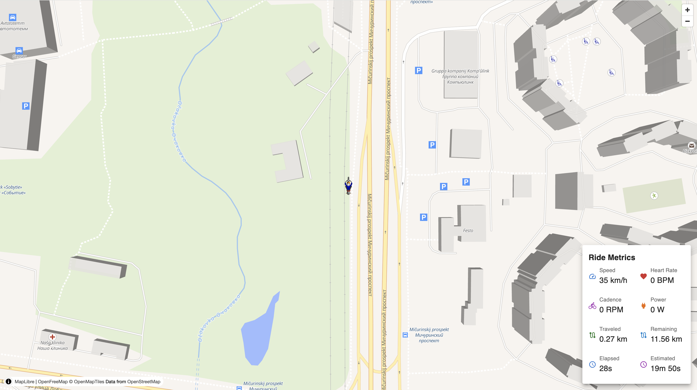

# Cycling app

Web app for riding a Bluetooth FTMS exercise bike using a OpenStreetMap

## Example

Live DEMO: https://mishannn.github.io/cycling-app/

Use GeoJSON LineString Feature object!

Screenshots:

